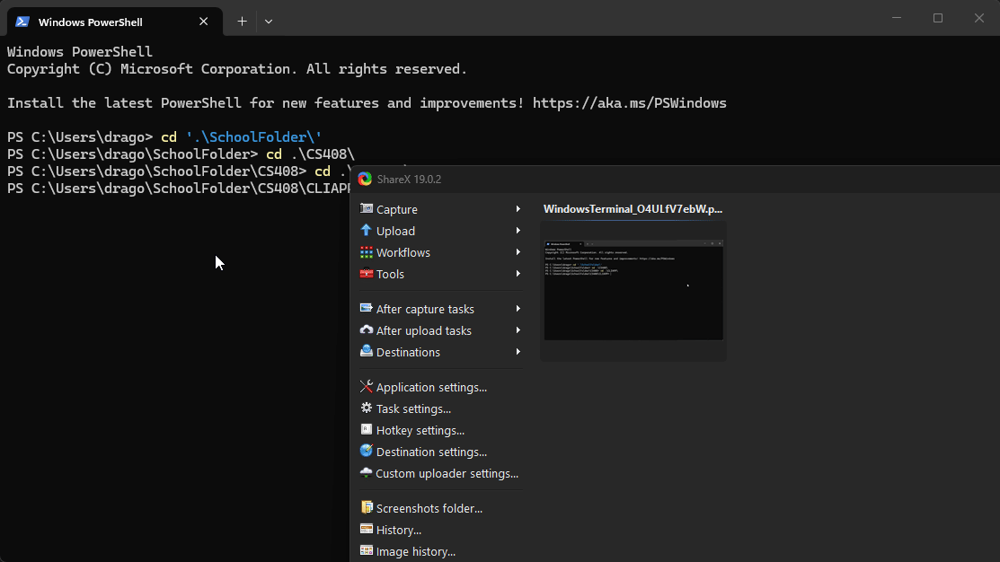

# Canvas CLI Assignment Tracker

### Project Description
This is a command-line tool designed to help students quickly view their active courses and upcoming assignment due dates directly from the terminal. It eliminates the need to navigate the Canvas web interface by providing a streamlined, text-based overview of academic deadlines.

### Demo

---

### Setup Instructions

1. **Clone the Repository** Open PowerShell and run:  
   git clone https://github.com/Calvinarnold12/CLIAPP.git  
   cd CLIAPP

2. **Install Dependencies** Run this command to install the necessary Python libraries:  
   python -m pip install requests python-dotenv

3. **Configure Your Environment** * Create a file named .env in the main folder.  
   * Add your Canvas Access Token:  
     CANVAS_API_TOKEN=your_actual_token_here  
   * The .gitignore file will keep this token private.

4. **Run the Tool** python main.py

---

### Usage Examples

**Example 1: Listing Courses** The script automatically finds your active enrollments from the [Canvas API](https://boisestatecanvas.instructure.com/doc/api/live).

**Example 2: Viewing Assignments** Enter a Course ID when prompted to see all upcoming deadlines.

---

### API Endpoints Used

| Method | Endpoint | Data Retrieved |
| :--- | :--- | :--- |
| GET | /api/v1/courses | Course IDs and Names for active enrollments. |
| GET | /api/v1/courses/:id/assignments | Names and timestamps for a specific course. |

---

### Reflection

Through this mini-lab, I learned the critical importance of secret management. I initially committed my .env file to a public repository, which taught me why .gitignore is a mandatory tool. I learned how to revoke a compromised token, delete a repository, and set up a .env.example file.

The biggest technical hurdle was the initial environment setup on Windows. I encountered issues where pip was not recognized, requiring me to troubleshoot my Python PATH. Additionally, handling the Canvas pagination was a new concept; learning to check the "Link" header ensured I was fetching all assignments, not just the first page.

If I had more time, I would improve the user interface with a library like Rich to color-code assignments based on urgency. I would also add a feature to filter assignments by "Upcoming" versus "Past."